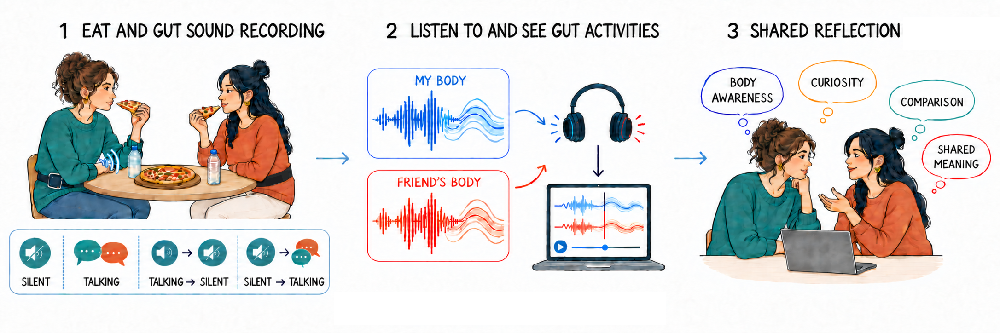

# GUTogether

Research codebase for a gut-sound sensing and physiological (heart rate / EDA) synchronized-listening experiment. This repository contains the software developed across the project's different stages; each subfolder also has its own more detailed documentation.



## Structure

| Folder | Description |
|---|---|
| [`OpenGut/`](OpenGut) / [`OpenGut-Cuda/`](OpenGut-Cuda) / [`OpenGut-VAD/`](OpenGut-VAD) | Three variants of the OpenGUT hardware + software platform (belt-worn gut-sound sensor, host-side GUI, firmware). `-Cuda` additionally integrates GPU-accelerated audio source separation (AudioSep); `-VAD` adds voice-activity-detection-based filtering. All three share essentially the same codebase. |
| [`EmotiBit/`](EmotiBit) | Material related to the EmotiBit wearable physiological sensor (heart rate, EDA) used for the physiological-response side of the experiment. |
| [`HR-EDA-Time-Alignment/`](HR-EDA-Time-Alignment) | Standalone viewer/recorder that subscribes to EmotiBit's LSL `HR`/`EDA` streams and applies time correction so signals from independent devices share one clock. |
| [`GutSound-HR-EDA-Sync/`](GutSound-HR-EDA-Sync) | Web tool that plays a selected gut-sound recording while synchronously recording HR/EDA from a live EmotiBit device, aligned to the same playback start time (t=0); each session produces an aligned waveform + physiology dataset. |
| [`River/`](River) | TouchDesigner project and shaders for an audio-reactive visualization ("river") driven by gut-sound playback. |
| [`run_website.sh`](run_website.sh) | Convenience script that launches the local services above in sequence. |
| [`log.md`](log.md) | Running changelog of cross-project code changes. |

## System requirements

- OS: the scripts/dependencies here were primarily developed and tested on Windows (`run_website.sh` runs under Git Bash and expects `.venv`/`env` virtualenvs with `Scripts/python.exe`); the `AudioSep` component under `OpenGut-Cuda`/`OpenGut-VAD` has also been verified on macOS (CPU/MPS). Paths will need adjusting on Linux.
- Physical hardware is required for live data acquisition: an EmotiBit wearable sensor (HR/EDA, streamed over LSL) and an OpenGUT custom PCB (gut sound). Without this hardware you can still run each tool's UI / offline-processing pieces, but not real-time acquisition.
- GPU: optional — see "Is CUDA required?" below.

## Python / Node.js versions

Everything in this repository is Python; **no Node.js is required** (`GutSound-HR-EDA-Sync/website/frontend` is plain static HTML/CSS/JS with no build step, served directly by the FastAPI backend).

Python version requirements differ per sub-project — **use a separate virtual environment per sub-project** rather than sharing one:

| Sub-project | Python version |
|---|---|
| `HR-EDA-Time-Alignment` | >= 3.10 |
| `GutSound-HR-EDA-Sync/website/backend` | >= 3.10 (same `pylsl`/`numpy` baseline, plus FastAPI/librosa) |
| `OpenGUT-main/Software` under `OpenGut` / `OpenGut-Cuda` / `OpenGut-VAD` | 3.12 (its own README specifies 3.12.13, installed via pyenv) |

## Installing dependencies

Run these from within each sub-project's own directory. The `.venv` / `env` virtualenv folders are excluded via `.gitignore` and need to be created locally:

```bash
# HR-EDA-Time-Alignment
cd HR-EDA-Time-Alignment
python -m venv .venv
.venv\Scripts\pip install -e .          # Windows
# or: .venv/bin/pip install -e .        # macOS/Linux

# GutSound-HR-EDA-Sync website backend
cd GutSound-HR-EDA-Sync
python -m venv .venv
.venv\Scripts\pip install -r website/backend/requirements.txt

# Software under OpenGut / OpenGut-Cuda / OpenGut-VAD (same relative path in each)
cd OpenGut/OpenGUT-main/OpenGUT-main/Software     # or the OpenGut-Cuda / OpenGut-VAD equivalent
python -m venv env                                 # requires Python 3.12
env\Scripts\pip install -r requirements_pyenv3.12.13_venv.txt   # if you need AudioSep
# or, for the base dependencies only:
env\Scripts\pip install -r requirements.txt
```

## Starting GUTogether

Prerequisite: you've created the virtual environments described above for `GutSound-HR-EDA-Sync`, `OpenGut-Cuda`, and `HR-EDA-Time-Alignment` (`run_website.sh` hardcodes their relative paths).

```bash
bash /d/AAAAAAAA/run_website.sh
```

This launches, in order:

1. The `GutSound-HR-EDA-Sync` website backend → http://localhost:8000/
2. The `OpenGut-Cuda` Software GUI (waveform/spectrogram/annotation tool)
3. `HR-EDA-Time-Alignment`'s `dual-emotibit-viewer`

`River` (TouchDesigner) is not auto-started by the script — open its `.toe` project manually. The script is safe to re-run: anything already running is skipped rather than duplicated. You can also start any single component manually per its own README instead of running everything at once.

## Using OpenGut recording

Using `OpenGut/OpenGUT-main/OpenGUT-main/Software` as the example (the `-Cuda`/`-VAD` variants share the same path):

1. Run `python main.py` to open the GUI.
2. Go to the "Device Config" tab, configure and export `config.json`, and copy it onto the OpenGUT PCB's microSD card.
3. Put the microSD card back into the PCB board and perform the actual gut-sound recording session (the device records offline, to the card).
4. Afterwards, remove the microSD card, load the recorded WAVE file via the file browser on the left of the GUI to view its waveform/spectrogram in the center pane, and annotate it in the right pane (start/end markers, comments); annotated segments can be exported as new WAVE files.

See [`OpenGut/OpenGUT-main/OpenGUT-main/Software/README.md`](OpenGut/OpenGUT-main/OpenGUT-main/Software/README.md) for full details.

## AudioSep model / download requirements

Both `OpenGut-Cuda` and `OpenGut-VAD` include AudioSep (natural-language-driven audio source separation) code, but **the pretrained model checkpoints are not included in this repository** (several GB, and they're generic weights that can be freely re-downloaded upstream rather than data belonging to this project). Before using this feature, download them yourself and place them under the corresponding `Software/AudioSep/checkpoint/` directory:

- Download location: AudioSep's official checkpoint page on Hugging Face (the `checkpoint/` folder under the `audio-agi/AudioSep` space).
- Files referenced by the code here: `audiosep_base_4M_steps.ckpt` and `music_speech_audioset_epoch_15_esc_89.98.pt`.

See [`Software/AudioSep/README.md`](OpenGut-Cuda/OpenGUT-main/OpenGUT-main/Software/AudioSep/README.md) in either variant for full setup steps, including PyTorch version-compatibility notes.

## Is CUDA required?

**No.** The AudioSep inference code auto-detects the device (`cuda` if available, else falls back to `cpu`; `mps` also works on macOS) — it runs on CPU, just more slowly. The point of the `OpenGut-Cuda` variant is that it has been verified/tuned on a machine with an NVIDIA GPU, but the same AudioSep code in `OpenGut` and `OpenGut-VAD` runs equally well CPU-only. Without a GPU, prefer `OpenGut` or `OpenGut-VAD`, or just run `OpenGut-Cuda` in CPU mode.

## Sample data

**This repository does not include any sample/demo data** (no example audio, example HR/EDA recordings, example screenshots, or demo videos). Every data file type actually used by these tools (`.wav`, images, video, etc.) is excluded wholesale via `.gitignore`; to try these tools you'll need to record with your own hardware (EmotiBit, OpenGUT board) or supply your own test data matching each tool's expected input format.

## Data withheld for privacy reasons

This project involves human-subjects research. The following is **deliberately excluded from this repository** for privacy reasons:

- `Report/`: dissertation/report drafts and their figures, which include actual photographs of study participants.
- Raw questionnaire and interview data (interview transcripts, questionnaire CSV exports).
- `Participant_Gut_Sounds/` in each OpenGut variant: raw/processed participant gut-sound recordings.
- `GutSound-HR-EDA-Sync/Final/` and the corresponding HR-EDA session data: per-participant, per-timestamp session recordings + physiological signals + summary images.
- Any raw-recording directories produced by later acquisition scripts (e.g. `HR-EDA-Time-Alignment/data/`).
- A configuration file that once contained a real Wi-Fi password, vendor installer binaries, and other content unrelated to research data but not suitable for publishing.
- All audio/image/video files are excluded wholesale, whether or not they involve participants, to avoid any accidental omission.

To reproduce the experiment or obtain the original dataset, please contact the project maintainer directly.
